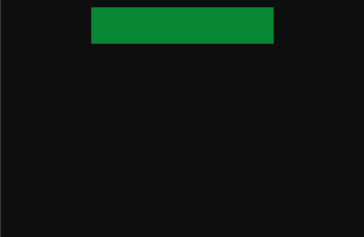

# gold: a data-driven widget toolkit

`gold` is a UI widget-making toolkit for C++23 that uses imgui as a backend.
"data-driven" means that the main way you specify how a widget looks is through
data outside of code. While this library uses yaml with custom keywords that
for specific widget parameters, it often looks similar css:

```yaml
# widget.yaml
align: [center, top]
size: [200, 40]
bg-color: [0, 1, 0.35]
```



## Installing

### Depenencies

#### Library

- [yaml-cpp](https://github.com/jbeder/yaml-cpp)
- [EnTT](https://entt.docsforge.com/#introduction)

#### Example

- [SDL2](https://wiki.libsdl.org/SDL2/FrontPage)
- [ion](https://entt.docsforge.com/#introduction)

### Instructions

```commandline
git clone https://github.com/josiest/gold.git
mkdir gold/build
cd gold/build
cmake ..
cmake --build .
cmake --install . --prefix <path/to/your/project>
```

## Usage 
To come ...